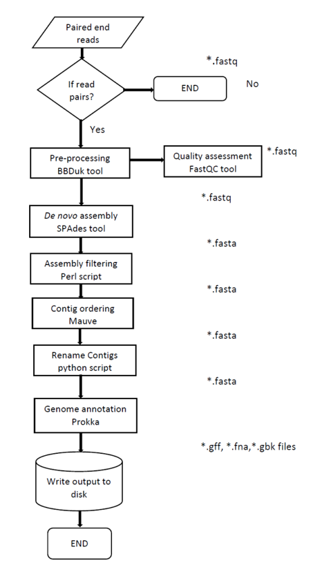

# BACTpipe
BACTpipe implemented in Nextflow.

Bactpipe uses Nexflow as a workflow tool manager. It takes paired end fastq
files as input and performs pre-processing, quality assessment, de novo
assembly, filtering for coverage and contig length, ordering the contigs to a
reference genome, and annotation of the genome. 

## Requirements
* nextflow.config file
* Reference genomes for both Mauve and prokka
* Raw fastq format paired end read files
* Adapters file

## Dependencies
Make sure to install the following software and have the executables in your `$PATH`:

* Nextflow (https://www.nextflow.io/) `nextflow` executable to run the pipeline
* Mauve's (http://darlinglab.org/mauve/download.html) `progressiveMauve` executable
* tbl2asn (https://www.ncbi.nlm.nih.gov/genbank/tbl2asn2/) `tbl2asn` executable
* `bbduk` executable from BBMap (https://github.com/BioInfoTools/BBMap)

The rest of the dependencies are loaded as modules from the Uppmax Milou server. These include:

* FastQC as `module = 'bioinfo-tools:FastQC'`
* SPAdes assembler as `module = 'bioinfo-tools:spades/3.8.1'`
* Java (prerequisite for nextflow and Mauve) as `module = 'java/sun_jdk1.8.0_40'`
* Python 2.7 (prerequisite for rename_fasta.py) as `module = 'bioinfo-tools:python'`
* prokka annotation pipeline including dependencies as `bioinfo-tools:prokka:BioPerl/1.6.924_Perl5.18.4:hmmer/3.1b2:barrnap/0.8:SignalP/4.1c:aragorn/1.2.36:prodigal/2.60'`

## Run bactpipe.nf 
1. Modify the nextflow.config file including the 

* project - SLURM project
* reads - Read input file format file, default `"*_{R1,R2}.fastq.gz"`
* adapters - Path to bbduk `adapters.fa` file
* mauve_ref - Path to the complete genome fasta file to be used by Mauve order_contigs tool (http://darlinglab.org/mauve/user-guide/reordering.html)
* mauve_path - Path to Mauve executable `Mauve.jar`
* prokka_ref - Path to the protein fasta file to be used as primary annotation source, for details, see https://github.com/tseemann/prokka#fasta-database-format
* output_dir - Path to the directory for output, default `./results`

2. Place the `bactpipe.nf` and the `nextflow.config` file or symbolic links to them in the folder containing the raw read files

3. Invoke the nextflow script
*  `nextflow run bactpipe.nf`
*  Options: `-resume` (in case you make a rerun from any step of the pipeline)

## License
This pipeline is published under the MIT license 2017

## Authors
Joseph Kirangwa (@b16joski), 
Sandra Alvarez-Carretero (@sabifo4),
Fredrik Boulund (@boulund),
Kaisa Thorell (@thorellk)
