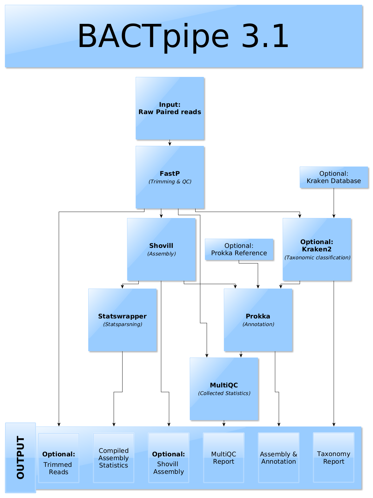

# BACTpipe 
BACTpipe is a whole genome sequencing workflow. It does quality assessment of
paired input reads, tries to assess if the sample contains mixed or pure
isolates, performs *de novo* assembly, and annotates the assembled genome.
BACTpipe uses Nextflow as a workflow manager. 

## Documentation
Complete documentation is available at https://bactpipe.readthedocs.io. 

## Quick-start
You need to have [Nextflow](https://www.nextflow.io), more specifically [v21.04.0](https://github.com/nextflow-io/nextflow/releases/download/v21.04.0/nextflow-21.04.0-all) and [conda](https://conda.io/docs/) installed.
When running with the default local profile all other software will be installed into local environments by conda througout the process. 

## Run BACTpipe
Nextflow makes it easy to run BACTpipe:

    $ nextflow run ctmrbio/BACTpipe --reads 'path/to/reads/*_R{1,2}.fastq.gz'

This will run BACTpipe locally. For more details on how to run BACTpipe, see
the official documentation at https://bactpipe.readthedocs.io.

## License
BACTpipe is published under the MIT license 2018-2021

## Authors

- Abhinav Sharma (@abhi18av)
- Emilio Rudbeck (@emilio-r)
- Joseph Kirangwa (@b16joski),
- Sandra Alvarez-Carretero (@sabifo4),
- Fredrik Boulund (@boulund),
- Kaisa Thorell (@thorellk)
