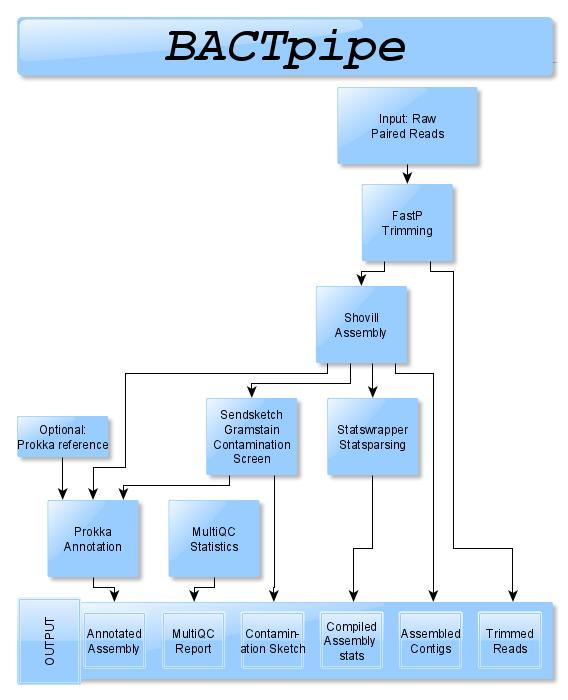

BACTpipe introduction and overview
==================================
BACTpipe uses whole genome shotgun sequenced, paired end reads, to assemble and
annotate single bacterial genomes.

BACTpipe's analysis flow starts with pre-processing of
paired end reads in fastq format using ``fastp``, and *de-novo* assembly using ``Shovill``.

Next, the draft genome fasta file headers are renamed to get unique genome-specific headers and assessment of the taxonomical classification of the assembly is performed using ``sendsketch.sh``. In this process the assembly will also be flagged if it is contaminated, i.e. contains more than one species. Lastly, the genus, species and Gram-staining information will be extracted for later use in the annotation process.

Finally, genome annotation is performed using ``prokka`` and basic statistics about the assembly and annotation are collected into a
HTML report using ``MultiQC``.

BACTpipe is implemented in Nextflow and an overview of the workflow can be seen
below. Output files are marked in blue.

